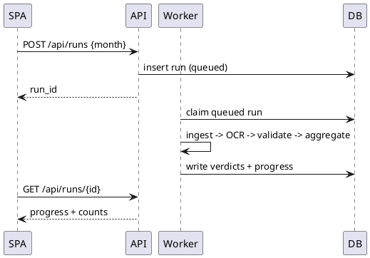
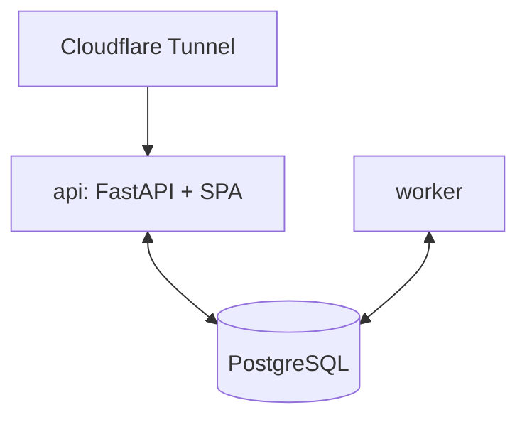

# Diagram Creation

Produce simple, version-controllable, text-based diagrams. One diagram per file,
one concept per diagram. No icons/images.

## Choosing the tool

**PlantUML** (`.puml`) for:
- Sequence diagrams (run orchestration, API ↔ worker ↔ DB, Google API calls)
- Class diagrams (engine models: Claim, ExtractedRoster, Verdict, CrewResult)
- State diagrams (run status: queued → ocr → validating → done; verdict states)
- Component diagrams (engine modules, web/worker/db relationships)

**Mermaid** (`.mmd`) for:
- Architecture diagrams (Pi 5 containers, Cloudflare Tunnel, volumes)
- Pipeline / decision flows (ingest → OCR → validate → dedup → report)
- Entity relationships (PostgreSQL schema: runs, claims, verdicts, overrides, audit, config)

> The existing docs embed Mermaid inline (e.g. `docs/flows/system-flow.md`,
> `docs/architecture/architecture.md`). Match that style when updating those docs;
> use standalone diagram files under a `diagrams/` folder for new, reusable ones.

## Naming

- `NNN-category-purpose.{puml,mmd}` — e.g. `001-run-orchestration-sequence.puml`,
  `002-pi5-architecture.mmd`, `003-perdiem-schema-er.mmd`.
- Node/component names: PascalCase, clear, no obscure abbreviations.

## Each file should include a header

```
Title: [Diagram Title]
Description: [What it represents]
Last Updated: [Date]
```

## Examples

PlantUML sequence:


Mermaid architecture:


## Best practices

- Keep diagrams small and readable; split complex ones.
- Use consistent spacing and clear directional flow.
- Add a legend/notes for non-obvious elements; update when the system changes.
