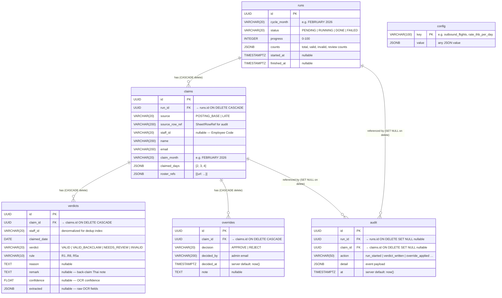

# ER Diagram — Per Diem Validation Database

```
Title:       Per Diem Validation — PostgreSQL Schema
Description: Entity-relationship diagram for the six tables defined in
             backend/perdiem/db/models.py (PD-PLAT-001).
             All IDs are UUID; timestamps are timestamptz; flexible
             fields use JSONB.
Last Updated: 2026-05-24
```



## Notes

| Constraint / Design decision | Detail |
|---|---|
| All IDs | UUID (`gen_random_uuid()`) — no sequential leakage |
| Timestamps | `TIMESTAMPTZ` — stored in UTC, displayed in local TZ by UI |
| Flexible fields | JSONB — `counts`, `claimed_days`, `roster_refs`, `extracted`, `detail`, `config.value` |
| `verdicts.staff_id` | Denormalized copy of `claims.staff_id`; enables the `(staff_id, claimed_date)` composite index for O(log n) dedup queries without a join |
| Override cascade | `ON DELETE CASCADE` — removing a claim removes its overrides; the audit row is preserved (`SET NULL`) for historical record |
| Audit durability | `run_id` / `claim_id` set to `NULL` (not deleted) when the parent is removed, so the audit trail survives claim deletion |
| Config history | Current value only; a `config_history` table can be added as a follow-up migration when PD-WEB-004 (config & audit screens) is built |

---

## Table & column explanations

### `runs` — one pipeline execution per cycle month

When an admin clicks **Run** in the web UI for, say, "FEBRUARY 2026", the system
creates one row in `runs`. Everything produced during that execution — all parsed
claims, all validation decisions — is linked back to this single row. If the admin
runs the same month again (to re-validate after fixing a config mistake), a new
`runs` row is created and the old one stays for comparison.

| Column | What it stores | Example |
|---|---|---|
| `id` | Unique identifier for this run (UUID). Used as the foreign key target for `claims` and `audit`. | `a3f2…` |
| `cycle_month` | The month being validated, in canonical uppercase English. | `FEBRUARY 2026` |
| `status` | Current lifecycle state of the run. `PENDING` = queued but not started; `RUNNING` = worker is actively processing; `DONE` = completed successfully; `FAILED` = pipeline error. | `RUNNING` |
| `progress` | Integer 0–100. The worker updates this as it finishes each claim, so the UI can show a live progress bar without hitting a heavy query. | `42` |
| `counts` | A JSON snapshot of running totals: how many claims were found, how many days came out VALID, NEEDS_REVIEW, or INVALID. Written by the worker at the end of the run and used by the results summary screen. | `{"total": 38, "valid": 30, "review": 5, "invalid": 3}` |
| `started_at` | Timestamp when the worker picked up the run and began processing. NULL while still PENDING. | `2026-05-24 09:01:00+07` |
| `finished_at` | Timestamp when the run reached DONE or FAILED. NULL while still in progress. The UI uses `finished_at - started_at` to show how long the run took. | `2026-05-24 09:04:31+07` |

---

### `claims` — one row per form submission

Each crew member submits their per diem claim via a Google Form. When the system
reads the response spreadsheet, it creates one `claims` row per form row. A single
crew member may appear more than once (they re-submitted, or they appear in both
the on-time and late-submission forms) — that is fine; the dedup logic handles it
at the `verdicts` level. Every claim belongs to exactly one `runs` row.

| Column | What it stores | Example |
|---|---|---|
| `id` | Unique identifier for this claim row. | `b7c1…` |
| `run_id` | Which run this claim belongs to. Deleting a run cascades and removes all its claims. | → `runs.id` |
| `source` | Which form the submission came from. `POSTING_BASE` = on-time (current month); `LATE` = back-claim (previous month). Determines which Google Sheet was read. | `POSTING_BASE` |
| `source_row_ref` | A precise pointer back to the original spreadsheet row, formatted as `"Sheet!A12"`. Used in the exception report so an admin can open the spreadsheet and find the exact row in question. | `Posting!A12` |
| `staff_id` | The crew member's 7-digit Employee Code as typed on the form. Can be NULL if the crew member left it blank — that triggers a NEEDS_REVIEW verdict. | `1775130` |
| `name` | The crew member's name as typed on the form. Used for display and fuzzy-matched against the name printed on the roster (R5a). | `Kanatsanan Wichitthararak` |
| `email` | The Google account email that submitted the form. Used as the login identifier and appears in the master report. | `kanatsanan@airasia.com` |
| `claim_month` | The month the crew is claiming for. Usually matches the run's `cycle_month`; if they differ the verdict becomes `VALID_BACKCLAIM` (R8). | `JANUARY 2026` |
| `claimed_days` | The list of day-of-month integers the crew said they flew. Sourced from the form field (e.g. "3, 4") and stored as a JSON array. These are what the engine validates against the roster. | `[3, 4]` |
| `roster_refs` | The Google Drive links the crew attached as proof (their crew schedule report). Stored as a JSON array of objects `[{"url": "https://drive.google.com/…"}]`. The worker downloads each URL and runs OCR on it. | `[{"url": "https://drive.google.com/file/d/abc…"}]` |

---

### `verdicts` — one row per (claim, claimed day)

This is the core output of the validation engine. For every day a crew member
claimed, the engine produces exactly one verdict row saying whether that day is
payable and why. If a crew claimed days 3 and 4, the engine writes two verdict
rows (one for each day). These rows are what the dedup + aggregation logic reads
to build the final master report.

| Column | What it stores | Example |
|---|---|---|
| `id` | Unique identifier for this verdict. | `c9d4…` |
| `claim_id` | Which claim this verdict belongs to. Deleting a claim cascades and removes all its verdicts. | → `claims.id` |
| `staff_id` | A copy of `claims.staff_id`, stored here again so that a fast query can find all verdicts for a staff member across all their claims without joining to `claims`. This powers the dedup index. | `1775130` |
| `claimed_date` | The absolute calendar date being decided (converted from the day-of-month integer in `claims.claimed_days`). | `2026-02-03` |
| `verdict` | The engine's decision for this one day. `VALID` = payable on-time claim; `VALID_BACKCLAIM` = payable but for a previous month; `NEEDS_REVIEW` = the system cannot be certain, an admin must check; `INVALID` = definitively not payable. | `VALID` |
| `rule` | The rule code that produced this verdict. Tells the admin (and the exception report) exactly why the decision was made — e.g. `R2` means the flight number was not in the eligible set. | `R8` |
| `reason` | A human-readable explanation of why the verdict was reached, included on the exception report. NULL for clean VALID verdicts. | `"flight FD9999 not in eligible set"` |
| `remark` | An optional Thai-language note attached to back-claim verdicts, matching the format of the existing master report (e.g. "ตกเบิกเดือนมกราคม"). NULL for on-time claims. | `ตกเบิกเดือนมกราคม` |
| `confidence` | A 0–1 score from the OCR step. Low confidence means the engine could not read the roster clearly — anything below the threshold produces NEEDS_REVIEW instead of a definitive pass/fail. NULL if OCR was not the deciding factor. | `0.87` |
| `extracted` | A JSON snapshot of the raw OCR-extracted fields (staff ID, name, date range, generated date) at the time of this verdict. Stored for auditability — if the OCR model is improved and re-run later, you can compare old vs new extractions. | `{"staff_id": "1775130", "name": "Kanatsanan W.", "generated_at": "2026-03-09 19:36"}` |

---

### `overrides` — admin manual decision on a claim

When the web UI flags a claim as NEEDS_REVIEW, an admin reviews the roster image
and clicks Approve or Reject. That decision is stored as an `overrides` row. A
claim can have multiple overrides over time (e.g. approved, then re-reviewed and
rejected). The most recent override wins during re-aggregation.

| Column | What it stores | Example |
|---|---|---|
| `id` | Unique identifier for this override decision. | `d2e8…` |
| `claim_id` | Which claim was overridden. Deleting a claim cascades and removes its overrides. | → `claims.id` |
| `decision` | The admin's decision: `APPROVE` (treat the day as payable despite the system's hesitation) or `REJECT` (confirm it should not be paid). | `APPROVE` |
| `decided_by` | Email address of the admin who made the decision. Appears in the audit trail so it is always clear who approved what. | `supervisor@airasia.com` |
| `decided_at` | Timestamp when the decision was recorded. Defaults to the current time on the database server. | `2026-05-20 14:32:00+07` |
| `note` | Optional free-text explanation the admin typed when making the decision. Useful for explaining unusual approvals — e.g. "Crew attached a different roster format, verified manually." | `"Verified via email — roster format non-standard but valid"` |

---

### `audit` — append-only event log

Every significant action the system takes is written to `audit` as an immutable
row. Rows are never updated or deleted (the FKs are SET NULL rather than CASCADE
so the row outlives the referenced run or claim). This table is the answer to
"what happened and when?" — used by the Config & Audit screen (PD-WEB-004) and
for debugging production issues.

| Column | What it stores | Example |
|---|---|---|
| `id` | Unique identifier for this audit event. | `e5f0…` |
| `run_id` | The run this event relates to, if any. Set to NULL if the referenced run is later deleted — the audit entry stays. | → `runs.id` (nullable) |
| `claim_id` | The claim this event relates to, if any. Also nullable for run-level events (e.g. "run started"). | → `claims.id` (nullable) |
| `action` | A short machine-readable label describing what happened. Current values: `run_started`, `verdict_written`, `override_applied`, `run_finished`, `run_failed`. | `override_applied` |
| `detail` | A JSON payload carrying the context needed to understand the event — e.g. for `override_applied` it includes the decision and who made it; for `run_finished` it includes the final counts. | `{"decision": "APPROVE", "decided_by": "supervisor@airasia.com"}` |
| `at` | Timestamp of the event. Defaults to the current time on the database server. Always written; never changed. | `2026-05-20 14:32:01+07` |

---

### `config` — runtime rules configuration

The eligibility rules are not hard-coded — flight numbers rotate monthly, the per
diem rate could change, name-matching thresholds can be tuned. The `config` table
is the system's live settings store. The web UI's Config screen (PD-WEB-004) reads
and writes rows here. The worker loads the config at the start of each run so it
always uses the most up-to-date rules.

| Column | What it stores | Example |
|---|---|---|
| `key` | A unique string identifier for the setting. Acts as the primary key — there is exactly one row per setting name. | `outbound_flights` |
| `value` | The setting's value, stored as JSONB so it can be a number, a string, an array, or a nested object — whatever the setting needs. | `["FD3013", "FD3015"]` |

**Common keys used by the engine:**

| Key | Type | Meaning |
|---|---|---|
| `outbound_flights` | `string[]` | Flight numbers eligible for the DMK→HKT outbound leg (rotates monthly). |
| `return_flights` | `string[]` | Flight numbers eligible for the HKT→DMK return leg. |
| `rate_thb_per_day` | `number` | Per diem payment per payable day in Thai Baht (default 400). |
| `name_match_threshold` | `number` | Fuzzy-match score (0–1) below which a name mismatch triggers NEEDS_REVIEW instead of MATCH (default 0.8). |
