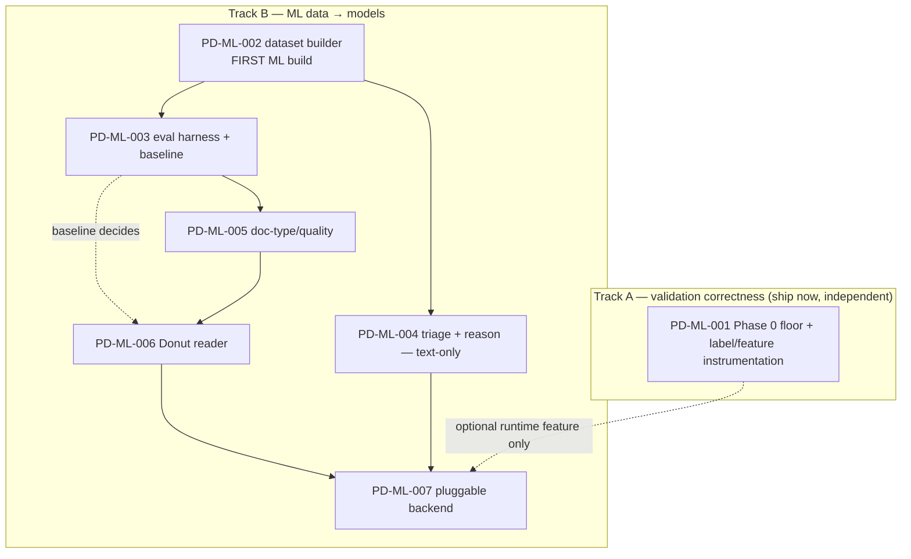

# 🗂 Epic Overview — EP-ML (Roster Intelligence)

The RosterIntelligence epic makes per diem **validation actually work** by attacking
its real failure point: turning **variable-quality roster images** (small, large, poor,
mixed formats) into trustworthy structured data, and learning from the **years of
admin-validated history** to triage claims. The validation rules (R1–R8) are largely
correct — the failures trace to **OCR extraction** (e.g. a real `AUGUST 2025` run had
**92 of 93 INVALIDs be R5 staff-ID misreads**, and most NEEDS_REVIEW were R1/R4 from the
flight grid not being read). See the analysis:
[../../analysis/ml-training-for-roster-validation.md](../../analysis/ml-training-for-roster-validation.md)
and [../../analysis/valid-roster-marked-invalid-r5.md](../../analysis/valid-roster-marked-invalid-r5.md).

This epic is **ML-for-extraction-and-triage**, not new business rules. Everything it
produces flows into the existing pipeline through the **same `ExtractedRoster` interface**
the rules already consume, so auditability (N1) and idempotency (N2) are preserved.

See [../../REQUIREMENTS.md](../../REQUIREMENTS.md) (§4 data sources, §5 rules R1–R8,
§6.2 OCR, §6.3 validation, §7 NFR). For the end-to-end build + runtime flow of this
epic (diagrams per story, how the three workbooks become labels), see
[../../flows/ml-flow.md](../../flows/ml-flow.md).

| Story ID  | Title                                                        | Reqs            | Status     |
| --------- | ------------------------------------------------------------ | --------------- | ---------- |
| PD-ML-001 | Phase 0 — deterministic floor + label instrumentation        | R5, F6, N1      | 🚧 In progress |
| PD-ML-002 | Labelled dataset builder from the three workbooks            | §4.1–4.3, R1–R8 | ✅ Done |
| PD-ML-003 | Per-field & end-to-end eval harness + baseline               | F6, F7, N1      | ✅ Done |
| PD-ML-004 | Triage + rejection-reason classifier (WS-3)                  | R4/R7/R8, F7    | ✅ Done (advisory; disabled by default) |
| PD-ML-005 | Roster doc-type / quality classifier                         | F6              | 📝 Planned |
| PD-ML-006 | Donut roster reader (WS-1) — *decision-gated*                | F4, F6          | 📝 Planned |
| PD-ML-007 | Pluggable ML extractor backend integration                   | F4, F6, N1, N2  | 📝 Planned |

## Guiding constraints (apply to every story)

- **Engine stays pure.** Training, dataset building, and evaluation code live **outside**
  `backend/perdiem/engine/` (under `backend/ml/` and `scripts/`). Only the **inference**
  backend (PD-ML-007) sits in `engine/ocr/`, and it **lazy-imports** heavy deps so engine
  unit tests still run with no torch/onnx (`.claude/rules/backend-standards.md`).
- **Pi 5, zero cost, local.** Train off-Pi; **export to ONNX + int8 quantise**; inference
  runs in the batch worker (`OCR_CONCURRENCY` pool). Rosters are **PII** — no cloud OCR/LLM
  in production; a hosted model may only be used **off-Pi as a labelling aid** on data
  explicitly cleared for it.
- **Never silently guess (N1).** ML improves *inputs* and *routing*; the deciding **rule +
  reason** stays the auditable arbiter. Low model confidence → `NEEDS_REVIEW`, never a
  guess.
- **Config-driven (§6.5).** Backends, thresholds, model paths, concurrency are env/config —
  never hard-coded.

## Build order — two independent tracks

These are **parallel tracks, not one sequence.** The ML data track does **not** wait on
Phase 0: the gold labels live in the **three workbooks (2018→2026), not the database**, so
the dataset builder can start immediately. Phase 0's persisted `extracted` is only a
*future runtime feature source*, never the training-label source.

- **PD-ML-001 (Phase 0)** is the fastest *validation-correctness* win and ships on its own —
  but it is **not a prerequisite** for anything in Track B. Do it in parallel.
- **PD-ML-002 (dataset builder) is the first ML build** and depends on nothing but the
  workbooks.
- **PD-ML-004 (triage/reason) needs no roster images** — only the workbook text — so it has
  the most data and the fastest ML payback; it can land right after the dataset exists.
- **PD-ML-006 (Donut) is decision-gated on PD-ML-003's baseline**: build it only if
  deterministic tuning (PD-ML-001) + triage (PD-ML-004) don't clear the bar.

## Two label tiers (why the ordering)

- **Text labels are abundant** — every monthly sheet of the three workbooks back to 2018
  (thousands of admin-decided rows). Feeds PD-ML-002/003/004 with **no images**.
- **Roster images are scarce** — only rows whose Drive links resolve / are cached. Bounds
  PD-ML-006; **synthetic + augmented rosters** fill the gap.

## Decision gate

| Question | Blocks | Resolve before |
|---|---|---|
| Does deterministic tuning (PD-ML-001) + triage (PD-ML-004) already clear the validation accuracy bar on the held-out month? | Whether to build the Donut reader | **PD-ML-006** |
| Labelling rule: is **blank admin Remark + present in master ⇒ approved** correct? | Label correctness | **PD-ML-002** |
