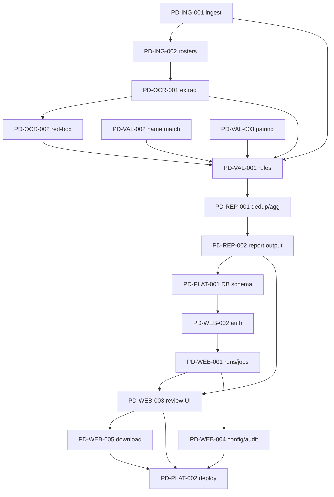

# 🧭 Implementation Order — Per Diem Validation System

The sequence to build the epics and stories in, derived from their dependencies.
Each story links to its detail file. IDs follow `PD-<EPIC>-NNN`.

**Guiding principle:** build the **pure engine first** (testable on the
`docs/example-files` fixtures with no DB or web), then add **persistence**, then
the **web app**, then **deployment**. This keeps the core verifiable in isolation
and means the website is a thin layer over already-working logic.

---

## 🔢 Order at a glance

| # | Story | Epic | Why here |
| - | ----- | ---- | -------- |
| 1 | [PD-ING-001](./Ingestion/story-001-form-response-ingestion.md) — Form ingestion | Ingestion | Nothing exists without claims; pure parsing, testable on fixtures |
| 2 | [PD-ING-002](./Ingestion/story-002-roster-attachment-retrieval.md) — Roster retrieval | Ingestion | Provides the image files OCR needs |
| 3 | [PD-OCR-001](./RosterOCR/story-001-roster-field-extraction.md) — Field & grid extraction | RosterOCR | Produces the data validation runs on |
| 4 | [PD-OCR-002](./RosterOCR/story-002-red-annotation-detection.md) — Red-box detection | RosterOCR | Needs grid geometry from PD-OCR-001 |
| 5 | [PD-VAL-002](./Validation/story-002-identity-name-matching.md) — Name matching | Validation | A predicate the rules engine calls |
| 6 | [PD-VAL-003](./Validation/story-003-out-and-back-pairing.md) — Pairing | Validation | A predicate the rules engine calls |
| 7 | [PD-VAL-001](./Validation/story-001-eligibility-rules-engine.md) — Rules engine | Validation | Orchestrates R1–R8 + uses #5 and #6 |
| 8 | [PD-REP-001](./Reporting/story-001-dedup-and-aggregation.md) — Dedup & aggregation | Reporting | Needs per-day verdicts from validation |
| 9 | [PD-REP-002](./Reporting/story-002-master-report-and-exceptions.md) — Report output | Reporting | Needs aggregated CrewResults |
| 10 | [PD-PLAT-001](./Platform/story-001-database-schema.md) — PostgreSQL schema | Platform | Backbone for the web app's state |
| 11 | [PD-WEB-002](./WebApp/story-002-authentication.md) — Authentication | WebApp | Gate before any PII screens/APIs |
| 12 | [PD-WEB-001](./WebApp/story-001-run-orchestration-and-jobs.md) — Run orchestration & jobs | WebApp | Drives the engine as a background job |
| 13 | [PD-WEB-003](./WebApp/story-003-results-and-exception-review-ui.md) — Results & review UI | WebApp | Needs runs + verdicts to display |
| 14 | [PD-WEB-005](./WebApp/story-005-publish-and-download.md) — Publish & download | WebApp | Exposes report writers; needs overrides applied |
| 15 | [PD-WEB-004](./WebApp/story-004-config-and-audit.md) — Config & audit screens | WebApp | Supporting screens; not on the critical path |
| 16 | [PD-PLAT-002](./Platform/story-002-docker-cloudflare-deployment.md) — Docker + Cloudflare deploy | Platform | Ship once the app works end-to-end |

---

## 🪜 Milestones

### Milestone 1 — Engine core _(no DB, no web)_
**Stories 1–9.** A runnable, unit-tested pipeline:
`ingest → retrieve rosters → OCR → validate → aggregate → write report`.
Verified against `docs/example-files` (FEBRUARY/MARCH 26). Output proves the
business rules before any UI exists.

> Build order within Validation matters: **PD-VAL-002 and PD-VAL-003 before
> PD-VAL-001**, because the rules engine orchestrates name matching and pairing.

**Exit criteria:** running the engine on the sample month reproduces sensible
payable days + amounts and an exception list.

### Milestone 2 — Persistence
**Story 10 (PD-PLAT-001).** Add the PostgreSQL schema + repositories. Wire the
engine's outputs (claims, verdicts, audit) into the DB so the web app can read
them. Engine logic itself is unchanged (it stays a pure library).

**Exit criteria:** a run's claims/verdicts/audit persist and survive a restart.

### Milestone 3 — Web application
**Stories 11–15.** Auth first (everything is PII-gated), then run orchestration +
background jobs, then the review UI, then download, then config/audit. After this
a non-technical staff member can run a cycle and review exceptions in a browser.

**Exit criteria:** sign in → pick month → Run → watch progress → review/override →
download report, entirely via the UI.

### Milestone 4 — Deployment
**Story 16 (PD-PLAT-002).** Package as Docker, run on the Pi 5, expose via the
existing Cloudflare Tunnel.

**Exit criteria:** staff open the Cloudflare hostname and run a full cycle;
services restart on reboot.

---

## 🔗 Dependency graph

> Note: PD-PLAT-001 is drawn after the engine for clarity, but it can be built in
> parallel with Milestone 1 since the schema doesn't depend on engine code — only
> the *wiring* (Milestone 2) does.

---

## 🚦 Decision gates (resolve before the dependent story)

| Open question (REQUIREMENTS §9 / story notes) | Blocks | Resolve before |
| --------------------------------------------- | ------ | -------------- |
| **R4 generated-date direction** — must generated date be after the claim? | Rules correctness | **#7 PD-VAL-001** |
| **Prisma vs Alembic/SQLAlchemy** for migrations | Persistence approach | **#10 PD-PLAT-001** |
| **Red box vs form day-list** as primary source of claimed days | Claimed-day source | **#4 PD-OCR-002 / #8 PD-REP-001** |
| **Flat 400 THB/day vs rank/route dependent** rate | Amount calc | **#8 PD-REP-001** |
| **Layover / Irregularity** claim types — same rules? | Rule scope | **#7 PD-VAL-001** |
| **Auth mechanism** — Google-restricted vs shared secret | Auth build | **#11 PD-WEB-002** |

---

## 🤖 Enhancement track — EP-ML (Roster Intelligence)

A **post-MVP** epic that fixes the real validation failure (OCR extraction) with ML and
learns from the years of admin-validated history. It layers on top of the pipeline above —
it does not block the MVP. See [./RosterIntelligence/overview.md](./RosterIntelligence/overview.md)
and [../analysis/ml-training-for-roster-validation.md](../analysis/ml-training-for-roster-validation.md).

Two **parallel** tracks (not one sequence):

| Track | Stories | Note |
| ----- | ------- | ---- |
| A — validation correctness (ship now) | [PD-ML-001](./RosterIntelligence/story-001-deterministic-floor-and-instrumentation.md) deterministic floor + instrumentation | Independent fast win; **not** a prerequisite for Track B |
| B — ML data → models | [PD-ML-002](./RosterIntelligence/story-002-workbook-dataset-builder.md) dataset (first ML build) → [PD-ML-003](./RosterIntelligence/story-003-eval-harness-and-baseline.md) eval/baseline → [PD-ML-004](./RosterIntelligence/story-004-triage-and-reason-classifier.md) triage (text-only, pull forward) → [PD-ML-005](./RosterIntelligence/story-005-doc-type-quality-classifier.md) doc-type → [PD-ML-006](./RosterIntelligence/story-006-donut-roster-reader.md) Donut reader *(gated on PD-ML-003 baseline)* → [PD-ML-007](./RosterIntelligence/story-007-pluggable-ml-extractor-backend.md) pluggable backend | Labels come from the **three workbooks**, not the DB |

> **Decision gate:** build PD-ML-006 (Donut) only if PD-ML-003's baseline shows extraction is
> still the bottleneck after PD-ML-001 + PD-ML-004.

## ⏩ Parallelisation hints

- **PD-PLAT-001 (DB)** can be developed alongside Milestone 1 by a second person.
- Frontend scaffolding (React + Vite + pnpm + Tailwind shell, routing, auth pages)
  can start during Milestone 1; it just can't integrate real data until the API
  (Milestone 3) exists.
- Within RosterOCR, preprocessing can be tuned in parallel with header-field
  extraction, both feeding PD-OCR-001.
