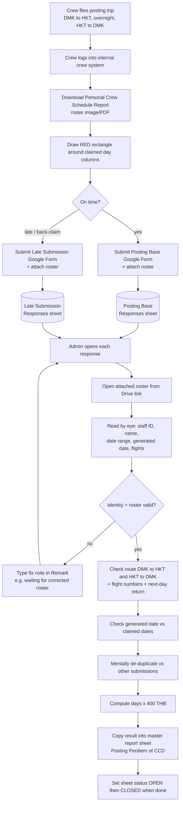

# Current Flow — Manual Per Diem Validation (As-Is)

How per diem claims are validated **today**, entirely by hand. See
[../REQUIREMENTS.md](../REQUIREMENTS.md) for rules and data sources.

## Cycle

Per diem is reconciled one month in arrears: while working in **March**, the
admin clarifies/pays claims for **February**.

## Step-by-step (manual)

## Pain points (why we are automating)

| # | Pain | Impact |
|---|------|--------|
| 1 | Every response opened and read by hand | Slow; doesn't scale with crew count |
| 2 | Roster images vary in quality (phone photos, rotation, glare) | Misreads, eye strain |
| 3 | De-duplication is done from memory across Posting Base + Late Submission + re-submissions | Double-pays / missed days |
| 4 | Route, flight-number and next-day-return checks done manually | Inconsistent enforcement; rotating flight numbers easy to get wrong |
| 5 | Name mismatches (`Lucksnara S.` vs full name) judged ad hoc | Valid claims delayed or wrong crew matched |
| 6 | Generated-date vs claim-date check is manual | Unproven (scheduled-not-flown) claims slip through |
| 7 | No audit trail of *why* a claim was paid/rejected | Hard to revisit disputes |

## Inputs / outputs today

- **Inputs:** two Google Form response workbooks (Posting Base, Late
  Submission); Drive-hosted roster attachments.
- **Output:** `Posting Perdiem of CCD 2026.xlsx`, one worksheet per month,
  manually typed.
- **Access:** done under the Google account `kantaphajasuwan@airasia.com`.
