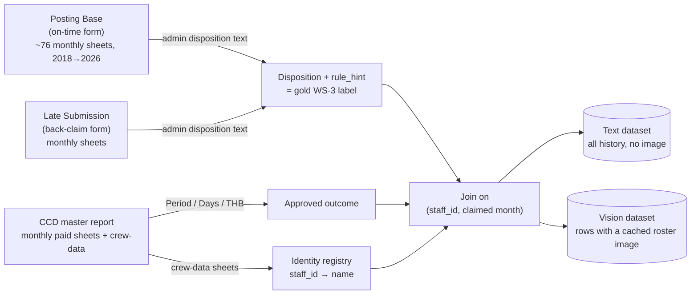
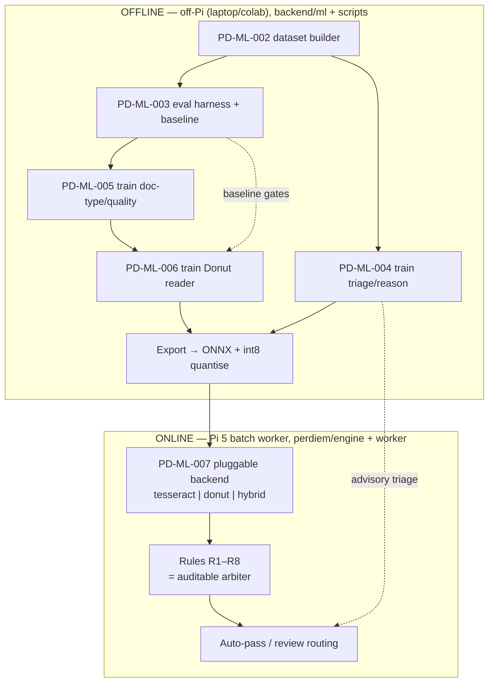
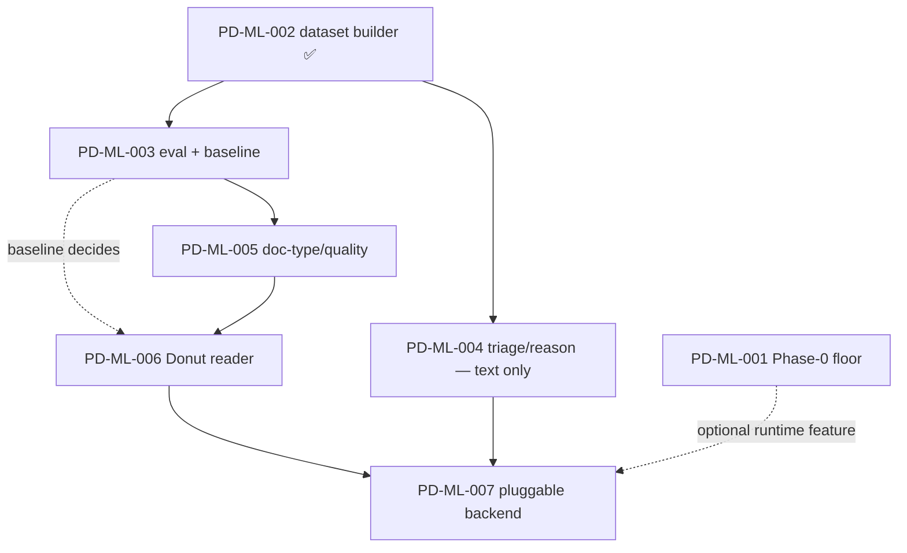
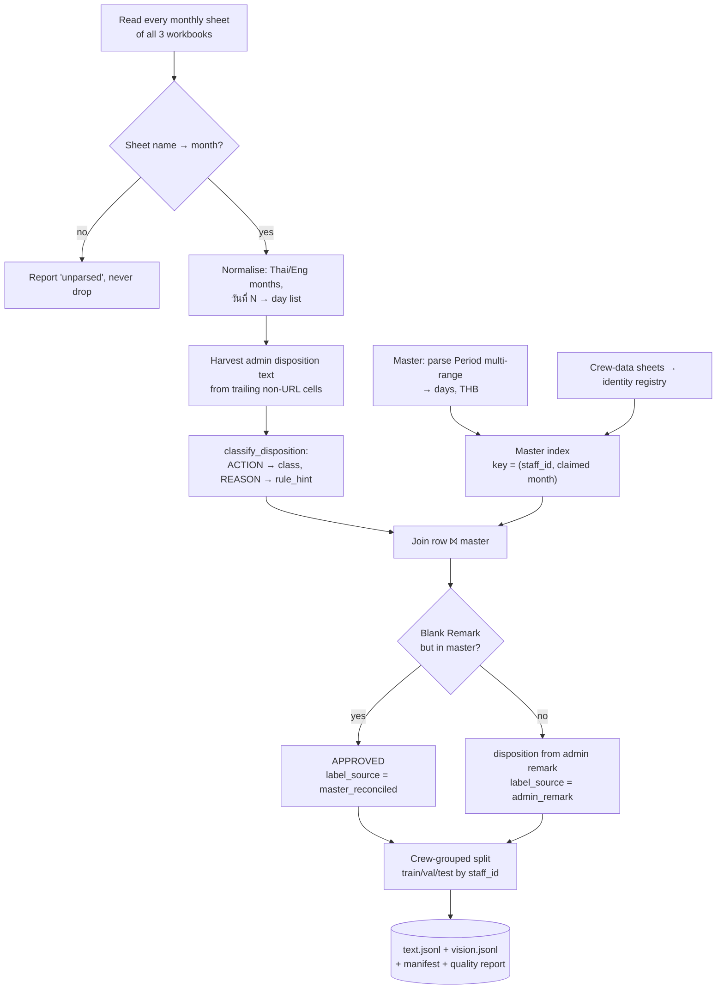
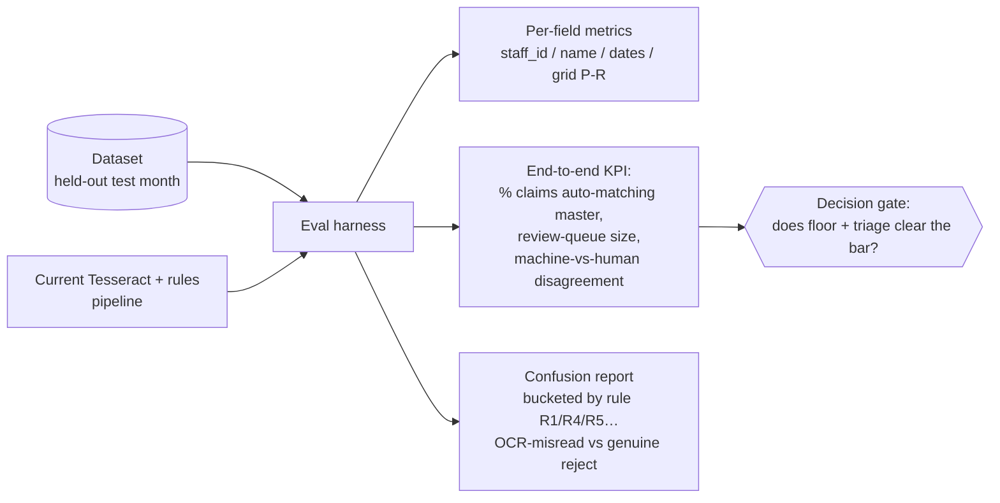
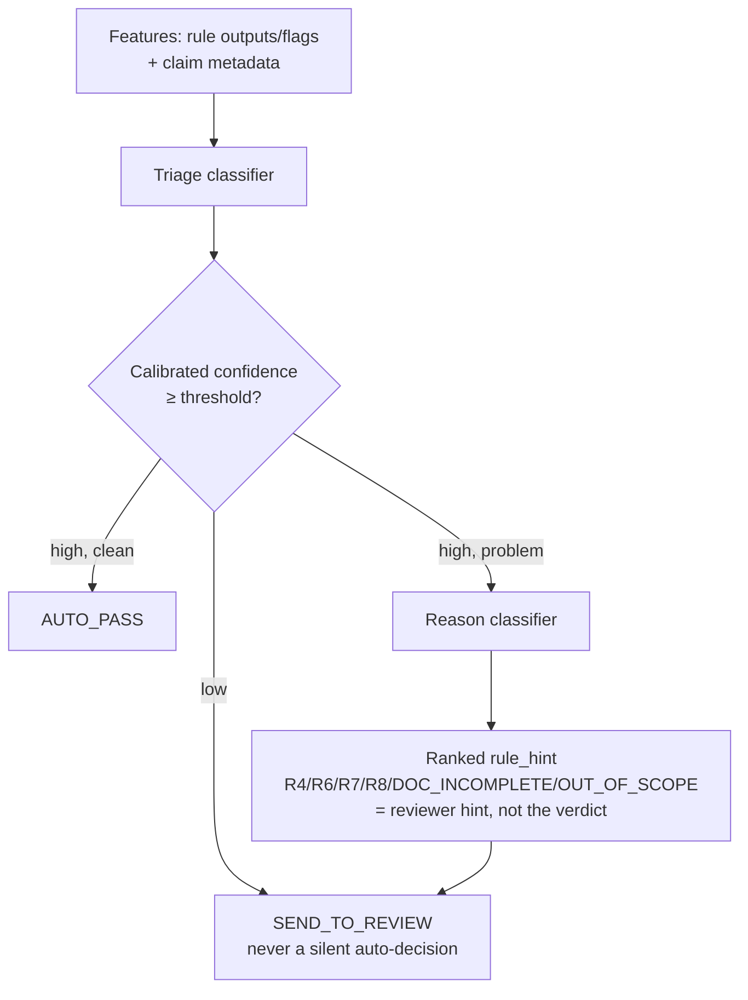
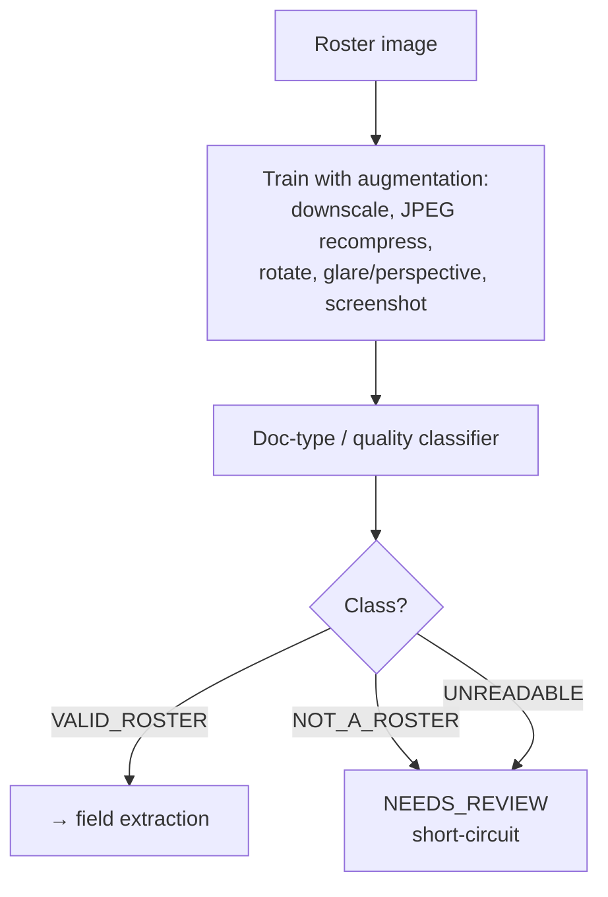
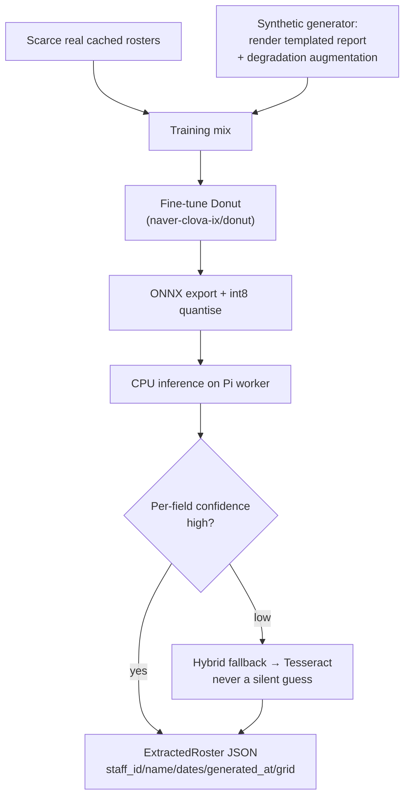
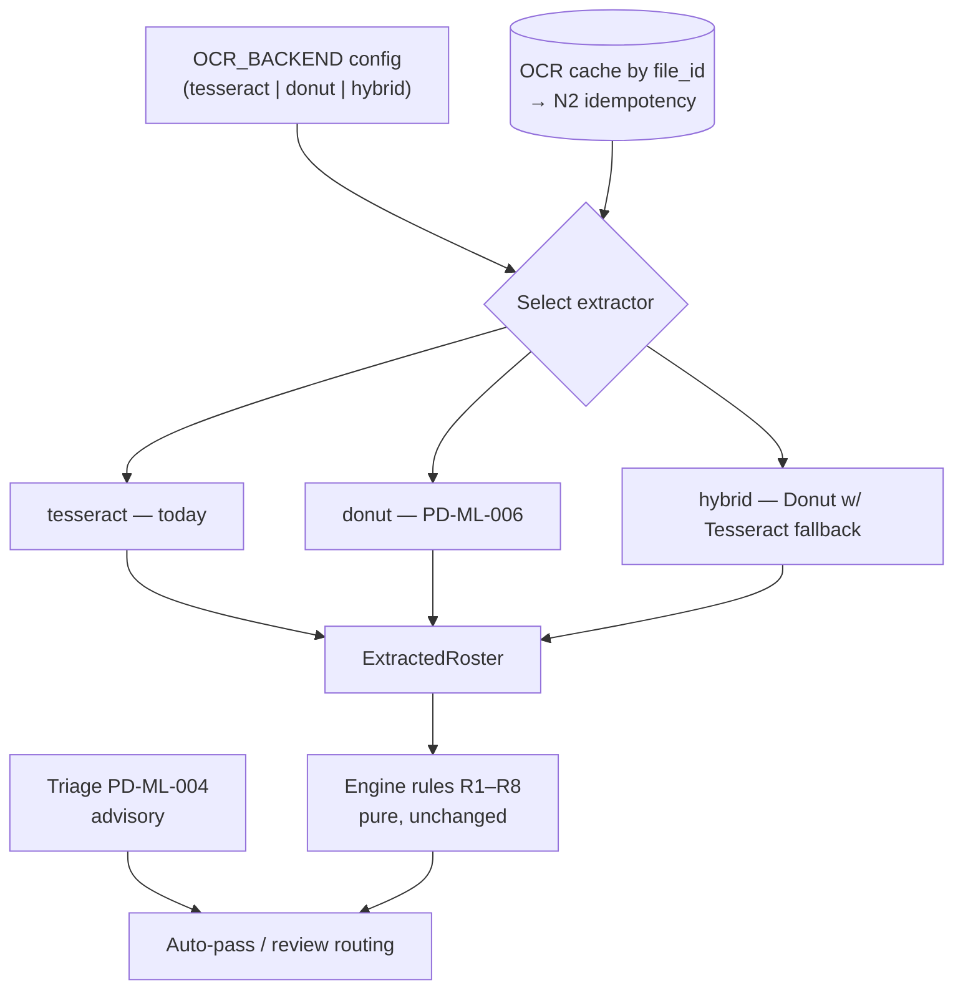
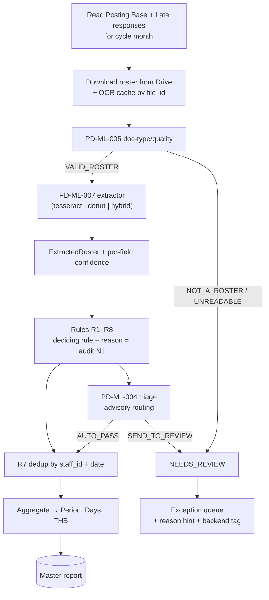

# ML Flow — Roster Intelligence (EP-ML)

How the **RosterIntelligence** epic is built and how it plugs into the live pipeline.
The epic does **not** add business rules — it improves the *inputs* (roster
extraction) and *routing* (triage) that feed the existing rules R1–R8, so
auditability (N1) and idempotency (N2) are preserved. Everything flows back through
the same `ExtractedRoster` interface the rules already consume.

See the epic [overview](../features/RosterIntelligence/overview.md), the per-story
docs (`docs/features/RosterIntelligence/story-00*.md`), the to-be
[system-flow](./system-flow.md), and [REQUIREMENTS.md](../REQUIREMENTS.md)
(§4 data sources, §5 rules, §6.2 OCR, §6.3 validation, §7 NFR).

> **Why this epic exists.** On a real `AUGUST 2025` run, **92 of 93 INVALIDs were R5
> staff-ID misreads** and most NEEDS_REVIEW were R1/R4 from an unread flight grid. The
> rules are right; **extraction** is the failure point. ML attacks extraction + triage.

---

## 1. The three workbooks are the ground truth

All learning signal comes from **years of admin-validated history** in three Excel
workbooks (`docs/example-files/`), **not** from the database. This is what lets ML
work start immediately, independent of Phase 0 / the live DB.

| Workbook | Role in the business | Role for ML |
|---|---|---|
| **Posting Base … (Responses).xlsx** | The **on-time form** — crew submit a claim the same cycle they flew. | Text labels: each row's admin disposition (`จ่ายเงิน` …) → `APPROVED/REJECTED/DEFER/REVIEW` + `rule_hint`. |
| **Late Submission … (Responses).xlsx** | The **back-claim form** — claims filed a month or more in arrears. | Same text labels; disposition lives in the *second note* column. Rich source of R8 (month-routing) and back-claim examples. |
| **Posting Perdiem of CCD 2026.xlsx** | The **master report** — what was actually **paid** (`Period`, `Days`, `Total THB`) + the **crew-data** identity sheets. | The *approved outcome* (join target) and the `staff_id → name` **identity registry** for R5/R5a. |



### Two label tiers (drives the build order)

- **Text labels — abundant.** Every monthly sheet back to 2018 = thousands of
  admin-decided rows, **no image needed**. Feeds the dataset (PD-ML-002), the eval
  baseline (PD-ML-003), and the triage/reason classifier (PD-ML-004). Fastest payback.
- **Vision labels — scarce.** Only rows whose roster Drive link resolves to a **cached
  image**. Bounds the doc-type classifier (PD-ML-005) and the Donut reader (PD-ML-006);
  **synthetic + augmented** rosters fill the gap.

---

## 2. Two planes: train **off-Pi**, infer **on-Pi**

The epic splits cleanly into an **offline (training/eval)** plane that lives under
`backend/ml/` + `scripts/` and never ships to the Pi, and an **online (inference)**
plane that runs in the batch worker. Only exported, quantised models cross the line.



**Guardrails (every story):** engine stays pure (no torch/onnx import in rule
functions; the ML backend lazy-imports heavy deps); rosters are **PII** → no cloud
OCR/LLM in production; **never silently guess** (low confidence → `NEEDS_REVIEW`);
backends/thresholds/model paths are **config**, never hard-coded.

---

## 3. Story-by-story flow

Build order is **two parallel tracks** (overview §"Build order"): Track A
(PD-ML-001, deterministic floor) ships on its own; Track B is the ML data→models
chain starting at PD-ML-002.



---

### PD-ML-002 — Labelled dataset builder ✅ (done)

**Purpose.** Turn the three workbooks into a versioned, normalised dataset that every
later story trains/evaluates on. **Depends on nothing but the workbooks.**

**Inputs:** the 3 `.xlsx` files. **Outputs:** `data/ml/datasets/<version>/` →
`text.jsonl`, `vision.jsonl`, `manifest.json` (source hashes + counts + labelling-rule
version), `quality_report.md`.



**Detail that matters (from the build):**
- The disposition column is **not stably named** — in Posting Base the `จ่ายเงิน`
  decision sits under a *URL header* (the literal "Remark" column is usually blank); in
  Late it's in the 2nd note. We harvest trailing non-URL cells rather than chase headers.
- Disposition mixes **action + reason** (e.g. "defer **and** back-pay | missing date") →
  two ordered tables so `disposition=DEFER_BACKCLAIM`, `rule_hint=R4` don't collapse.
- **Blank-Remark rule** (the project's decision gate): blank Remark **but present in the
  master ⇒ APPROVED**. One documented function — *confirm with admins.*
- Splits are **by crew**, never random by day → no leakage of one person across train/test.
- First run: **5,745 text rows**; vision split fills once the roster cache is populated.

---

### PD-ML-003 — Eval harness + baseline

**Purpose.** Fix a measuring stick **before** training anything, so the Donut decision is
evidence-based. Scores an extractor/decision backend; trains nothing.

**Inputs:** the versioned dataset (held-out **test month**). **Outputs:** per-field
metrics, an end-to-end KPI, and a recorded **baseline** of today's Tesseract+rules run.



**Process.** Run current pipeline → compare final payable days vs CCD master per claim →
emit metrics + a rule-bucketed error report. This **baseline** is the reference all later
stories report against, and it **arms the decision gate** for PD-ML-006.

---

### PD-ML-004 — Triage + rejection-reason classifier (WS-3)

**Purpose.** Auto-clear the obvious claims, rank a "likely problem" on the rest, queue only
the genuinely uncertain — *exactly as past admins decided*. **Text-only → most data,
fastest ML payback; can land right after the dataset.**

**Inputs:** the **text** dataset (`disposition` + `rule_hint`). **Outputs:** a pure scoring
function `features → {AUTO_PASS | AUTO_REJECT | SEND_TO_REVIEW}` + ranked `rule_hint`, with
**calibrated probabilities** and **abstention**.



**It routes, it does not decide.** R1–R8 remain the auditable arbiter; the classifier is an
advisory layer. No image features (those arrive via PD-ML-006/007). Ships as a pure function
the engine/worker can call **without** training deps.

---

### PD-ML-005 — Roster doc-type / quality classifier (WS-2)

**Purpose.** Flag obviously-wrong/unreadable attachments **up front**, so the pipeline
doesn't waste OCR on them or fabricate fields that misfire rules.

**Inputs:** vision dataset + seed labels (`roster-attached-files/correct/` vs `incorrect/`,
plus form rows whose admin reason was `DOC_INCOMPLETE`). **Outputs:** a classifier
`VALID_ROSTER | NOT_A_ROSTER | UNREADABLE`, run **before** field extraction.



---

### PD-ML-006 — Donut roster reader (WS-1) — *decision-gated*

**Purpose.** Read staff ID, name, dates, generated date, and the flight grid even from
small/blurry/skewed images — so **R5 stops false-rejecting** on misread IDs and **R1/R4 stop
flagging "no flights"** when the grid was merely unreadable.

> **Gate:** build only if PD-ML-003's baseline shows extraction is still the bottleneck
> *after* the Phase-0 floor (PD-ML-001) + triage (PD-ML-004).

**Inputs:** vision dataset + a **synthetic roster generator**. **Outputs:** a fine-tuned
Donut emitting the `ExtractedRoster` JSON with per-field confidence, exported to **ONNX +
int8** for Pi CPU inference.



---

### PD-ML-007 — Pluggable ML extractor backend integration

**Purpose.** Switch extractors **by config** with a safe hybrid fallback, so the model rolls
out gradually and **never regresses on a bad image — without touching the rules engine**.

**Inputs:** validated Donut (PD-ML-006) and/or triage (PD-ML-004). **Outputs:** an
`Extractor` protocol + config-selected backend wired into the worker; OCR-result cache by
`file_id`; the persisted `extracted` records *which backend* produced the fields.



**Engine purity:** the `Extractor` protocol lives in `engine/ocr/`, the ML backend
**lazy-imports** torch/onnx so engine unit tests still run with no heavy deps; the worker
reads `OCR_BACKEND`; rule functions never change.

---

## 4. Where ML lands in the live pipeline

This is the to-be [system-flow](./system-flow.md) with the ML components inserted. ML
changes the **front half** (what gets extracted, what gets short-circuited, how claims are
routed) — the rules, dedup, aggregation, and report are untouched.



---

## 5. Decision gate & success criteria

| Question | Blocks | Resolved by |
|---|---|---|
| Is **blank Remark + present in master ⇒ approved** the correct label? | Label correctness | **PD-ML-002** (confirm with admins) |
| After the Phase-0 floor + triage, is **extraction still the bottleneck** on the held-out month? | Whether to build Donut | **PD-ML-003 baseline → PD-ML-006** |

**Success = fewer false R5 rejects + a smaller review queue at equal-or-better payment
accuracy**, measured on the held-out month by PD-ML-003 — not model loss in isolation.

## 6. Auditability & idempotency (N1, N2)

- ML never overrides the verdict: the **deciding rule + reason** stays the auditable
  arbiter. Low model confidence routes to `NEEDS_REVIEW`, never a guess.
- The persisted `extracted` records **which backend** produced each field; re-running a
  cycle hits the **OCR cache by `file_id`** and reproduces identical rows — no
  double-counting.
- The dataset is **PII** (names, schedules): it stays local, `data/ml/` is gitignored, and
  no roster ever goes to a cloud model in production.
```
