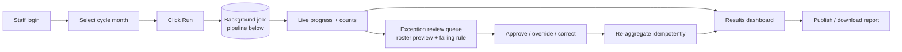
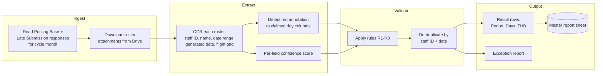
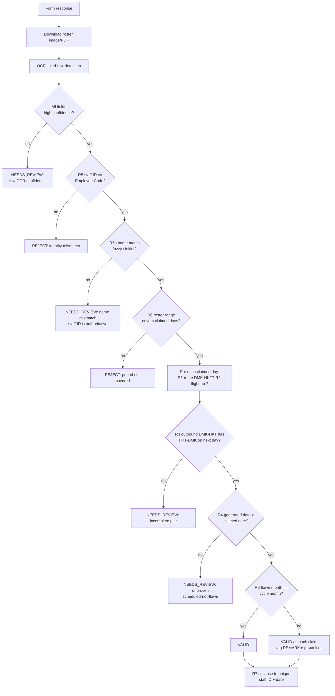
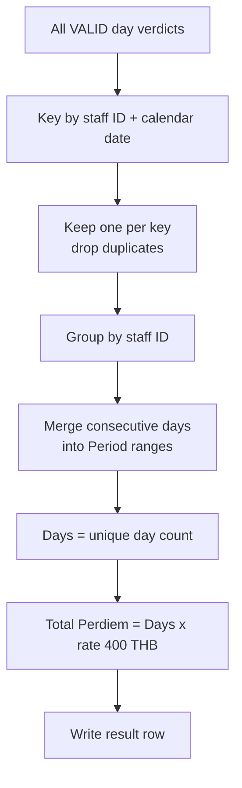

# System Flow — Automated Per Diem Validation (To-Be)

The target automated pipeline. Rules referenced (R1–R8, R5a) are defined in
[../REQUIREMENTS.md](../REQUIREMENTS.md). The system **assists**: it auto-clears
the clear-cut claims and surfaces everything uncertain for human review
(N3 — human-in-the-loop).

Staff operate this pipeline through a **self-hosted web frontend** (§6.6): they
pick the cycle month and press Run, watch live progress, then review/approve
flagged claims and download the report. The pipeline below runs as a background
job behind that UI.

## Staff interaction (web frontend)

## High-level pipeline

## Detailed decision flow (per response)

## De-duplication & aggregation (R7)

After per-day verdicts across **all** submissions for the cycle (Posting Base +
Late Submission + any re-submissions):

## Verdict model

| Verdict | Meaning | Lands in |
|---------|---------|----------|
| `VALID` | All rules pass | Master report (payable) |
| `VALID (back-claim)` | Passes but flown month ≠ cycle (R8) | Master report + REMARK |
| `NEEDS_REVIEW(reason)` | Plausible but uncertain (low OCR, name, incomplete pair, unproven date) | Exception report |
| `INVALID(reason)` | Hard fail (ID mismatch, period not covered, wrong route) | Exception report |

## Idempotency & audit (N1, N2)

- Re-running a cycle reproduces the same rows — keyed by `(staff ID, date)`, no
  double-counting.
- Every verdict stores: source response row, roster image reference, the rule
  that decided it, and OCR confidence — so any payment/rejection is auditable.

## Configuration surface (R2/F13)

| Setting | Example | Why configurable |
|---------|---------|------------------|
| Qualifying routes | `DMK→HKT`, `HKT→DMK` | May expand |
| Outbound flight numbers | `FD3013, FD3015` | **Rotates monthly** |
| Return flight numbers | `FD3026, FD3006, FD3038, FD3084` | **Rotates monthly** |
| Per diem rate | `400 THB/day` | Policy change |
| Cycle month | `February 2026` | Per run |
| Name-match threshold | fuzzy score cutoff | Tuning |
